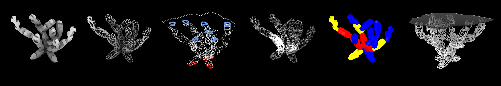

# Typological-Evolutionary-Optimization-Processes

This repository contains a series of workflows for different optimization techniques within the Grasshopper/Rhino platform. The workflows are divided into two sections: Typological Optimization and Evolutionary Optimization.

## Typological Optimization

The Typological Optimization workflows use the Topos plugin, which can be downloaded from [Food4Rhino](https://www.food4rhino.com/app/topos). It uses genetic algorithms to generate and evaluate multiple design alternatives and determine the optimal design. The workflow published was developed with the Topos Utentsils to automatically optimizes modular parts of a structure within given parameters. The outcome can be seen below. 

## Evolutionary Optimization

The Evolutionary Optimization workflows use two plugins: Galapagos and Wallacei. These plugins can be downloaded from [Food4Rhino](https://www.food4rhino.com/app/galapagos) and [Food4Rhino](https://www.food4rhino.com/app/wallacei). Galapagos is a genetic algorithm solver that can find optimal solutions to multi-goal optimization problems, and Wallacei is a plugin for interactive evolutionary multi-objective optimization. 

The workflow was created to optimize the distribution of water infrastructure along a masterplan according to energy efficiency. By setting multiple optimization goals, such as minimizing energy consumption and maximizing water usage efficiency, users can use the workflows in this repository to find the optimal solution to this problem.

